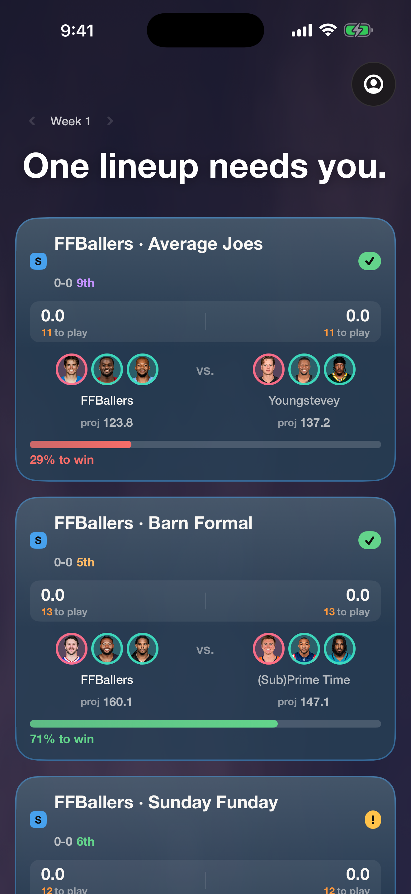
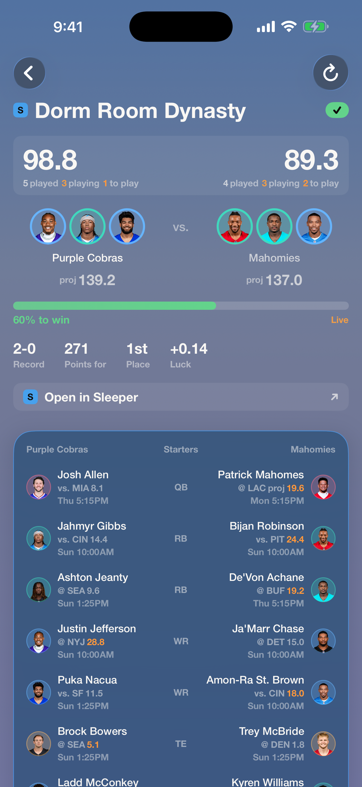
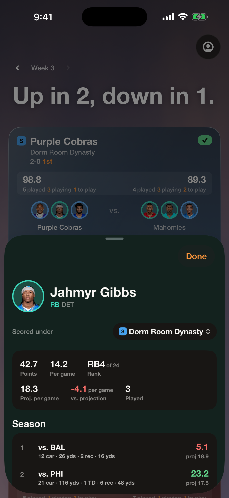
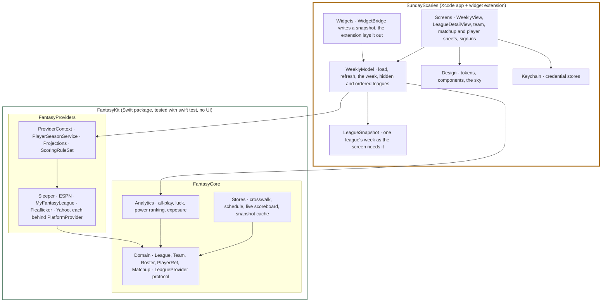

# Sunday Scaries

An iOS app that puts every fantasy football league you play in on one screen for the
week.

Most people who play fantasy football play in more than one league, on more than one
platform, and each platform has its own app, its own scoring and its own idea of who a
player is. Sunday Scaries reads them all through one library, matches the players across
platforms, and shows in one place whether each lineup is set, how each matchup stands,
who you are relying on everywhere and who is starting against you.

## Screens

| The week | A league | A player |
|---|---|---|
|  |  |  |

<!-- TODO: capture on device. docs/screenshots/week.png, league.png, player.png; a short GIF of the zoom into a league would go under the table. -->

## Architecture

Two repositories. [FantasyKit](https://github.com/shermdiggity/FantasyKit) is a Swift package with no UI: the domain
model, one provider per platform, identity resolution, caching, and the analytics. It
builds and tests on a Mac with `swift test`. This repository is the app: SwiftUI
screens, one model, the keychain, and a widget extension.

The kit is layered as Core (models, the provider protocol, pure analytics) and Providers
(one directory per platform, a shared context that builds what they have in common). The
app is layered by folder: `Model` orchestrates, `Screens` present, `Design` holds the
tokens and every reusable component, `Services` wraps the OS. `Shared` is a folder
compiled into both the app and the widget, so the widget wears the same tokens and reads
the same snapshot file. Credentials cross the boundary as values: the kit takes an
`ESPNCredentials` or a `MFLCredentials` and never stores one; the app keeps them in the
keychain.

## Design notes

Decisions I made, with what each one cost.

**Where the FantasyKit line is.** Anything that can run without a screen is in the kit:
reading a platform, matching players, caching, scoring, analytics. Anything that needs
SwiftUI, the keychain or WidgetKit is in the app. The test is "can it be verified on a
Mac in under a second". The cost is discipline: every public symbol in the kit is a
versioning event, and the API was narrowed once already (105 public types to 98) after an
audit found the app assembling the kit's internals by hand. The benefit is that the
whole logic suite runs in about a third of a second with no simulator, and the kit could
back a second client.

**Why no more targets.** The app is one target, a widget extension and a shared folder.
The kit is two modules. I considered a module per platform and a module for the
analytics, and decided against both: the kit-to-app boundary already enforces access
control, build times are not a problem, and more modules would have meant more public
symbols to version. The layering inside each repo is folders plus lint rules, which is
enough for one person.

**One screen.** The spec started with three tabs. The app is a single scrolling week,
ordered by what decays fastest: the one cross-league fact, then the league cards you can
still act on, then the portfolio, then the retrospective. A league detail is pushed with
a zoom transition. Everything else is a sheet.

**Cache-first, always.** Reads return cached data immediately and the network updates
it. A failed fetch keeps the last good snapshot and marks the league stale. A refresh
with cards on screen is quiet: cards are replaced in place, never flashed to skeletons.
The cost is that a lineup change can be a minute old, because Sleeper's edge caches the
live week for a minute; the app busts that cache only for live-week matchups.

**Never lose a player to a matching failure.** A player the crosswalk cannot resolve is
kept with his platform id and still renders in the lineup. He just cannot join the
cross-league counts. Dropping him would be the one unacceptable bug.

**ESPN, knowingly.** ESPN has no public API. The app hosts ESPN's own login page in a web
view and keeps the two session cookies in the keychain; the page's form is never read.
This works today and could stop working when ESPN ships something, so ESPN is treated
as the provider that may fail mid-season, and nothing depends on it alone.

**Skeletons, one shader, no spinners.** Loading is a skeleton that matches the real
component's geometry, so nothing reflows when data lands. The sky is one Metal shader
at half resolution and 15 frames a second, and it is the only animated shader in the
app: a second one made navigation stutter.

**What I did not build.** A custom drag-to-reorder for league cards: four versions
fought the scroll view and lost, so reordering is the native `List`. Yahoo is built to
the documentation but gated off until the API application is approved. CBS is not built:
its developer program no longer exists, and the only way in is scraping a token from a
logged-in page.

## Setup

- Xcode 26, iOS 26.
- Open `SundayScaries.xcodeproj`, set your team, run. FantasyKit is resolved from GitHub
  at a pinned version; nothing else to install.

Connecting platforms happens in the app, on the first screen:

- **Sleeper**: your username. Nothing else.
- **ESPN**: sign in on ESPN's page inside the app, then tap Import leagues. The session
  cookies go to the keychain and never leave the device. Public leagues work by id
  without signing in.
- **MyFantasyLeague**: sign in for private leagues and "my leagues", or add a public
  league by id. The password is used for one login request and not kept.
- **Fleaflicker**: the email on your account, or your user id.
- **Yahoo**: needs your own Yahoo developer app's client id and secret, and is off by
  default (`FeatureFlags.yahooEnabled`).

## Testing

The logic is tested in [FantasyKit](https://github.com/shermdiggity/FantasyKit): `swift test` there runs 285 tests
against captured JSON, with no simulator and no network. This repository builds in CI
against a generic iOS Simulator destination with strict concurrency and warnings as
errors; there is no app test target. Every reusable view appears in the component
gallery (`Debug/ComponentGallery.swift`) in every state, which is how visual drift is
caught.

## License

MIT, see [`LICENSE`](LICENSE). Not affiliated with Sleeper, ESPN, MyFantasyLeague,
Fleaflicker, Yahoo or the NFL.
